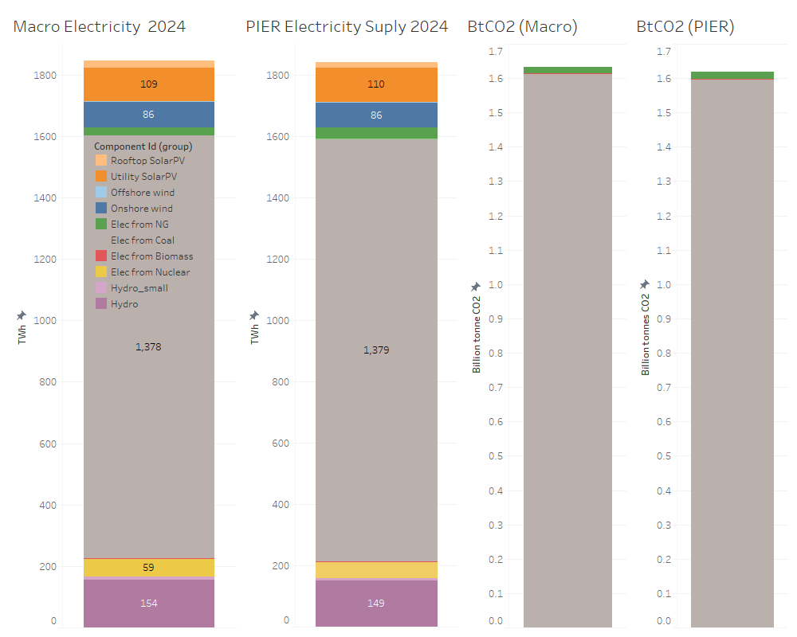
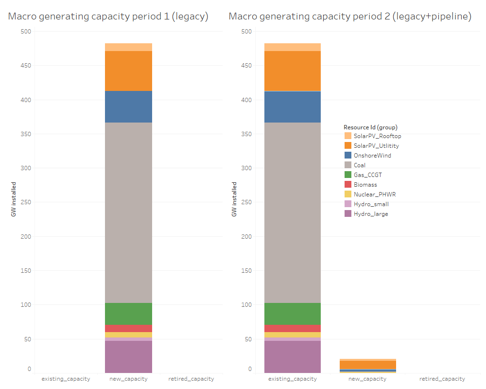
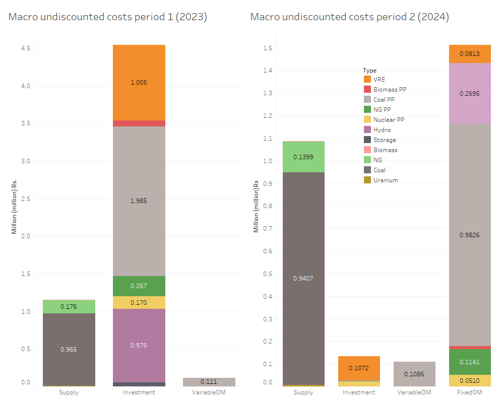

# (case) electricity_fiveZ_8736_2p_nziShadow_dev (Unofficial)

Version of case used for development and (nightly) backup by user. There is no gaurantee that this version of the case will a) run to completion in latest (unofficial) version of Macro OR b) work as expected.

When this version reaches stable operation and represents a useful update to the *stable* version, it will be merged into *_stable. If it is time period or regional expansion of a prior model, it will be become a new *stable* version.

5 May 2026
    Updated costs to for proper relationship wrt PIER2.0 costs (largely divide by 3)
    Upate R code for pre-processing of PIER2.0+Rumi input/output data for input into Macro
    CO2 emissions from coal generation appears to be between values in PIER - TBD

 "Macro vs PIER2.0 Generation and CO2 emissions"

 "Macro Period Capacities 2023 (left), 2024 (right)"

 "Macro Period Costs 2023 (left, shows investment annuities for legacy capacity), 2024 (right shows new CAPEX investments in capacity added in 2024). Taxes and other handling fees not in variable O&M for different carriers need to be added, as well as costs for all carrier transfers."