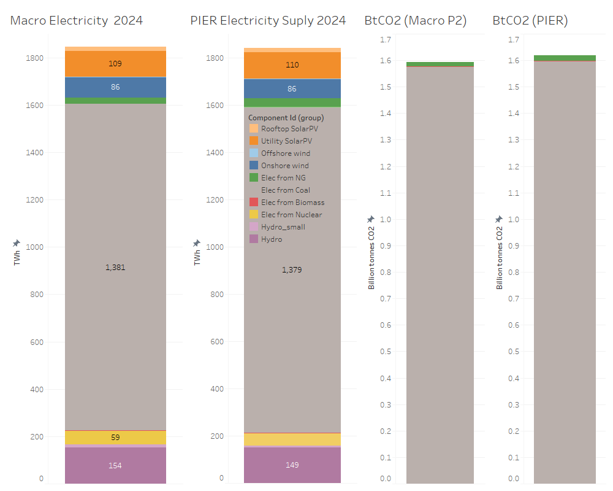
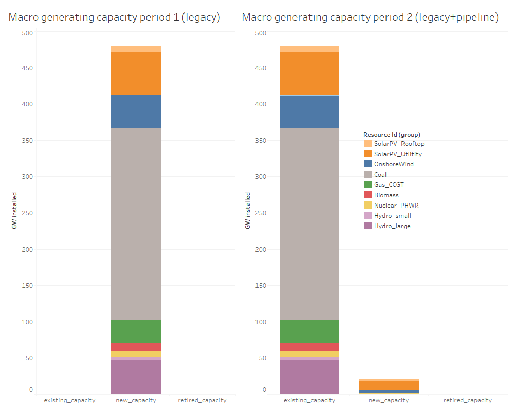
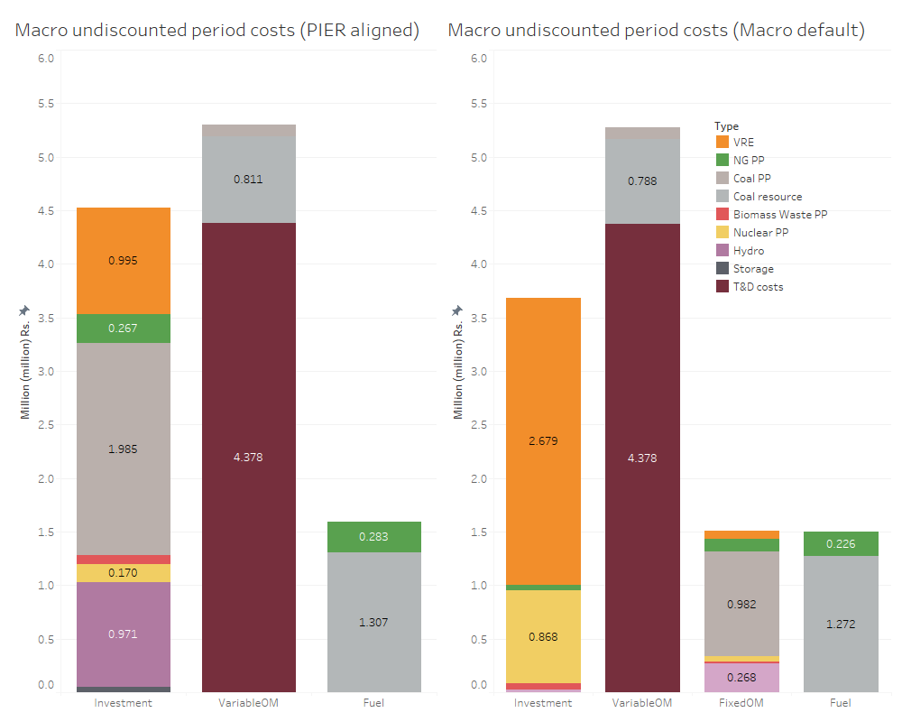

# (case) electricity_fiveZ_8736_2p_nziShadow_dev (Unofficial)

Version of case used for development and (nightly) backup by user. There is no gaurantee that this version of the case will a) run to completion in latest (unofficial) version of Macro OR b) work as expected.

When this version reaches stable operation and represents a useful update to the *stable* version, it will be merged into *_stable. If it is time period or regional expansion of a prior model, it will be become a new *stable* version.

## Macro vs PIER2.0 comparison
 "Macro vs PIER2.0 Generation and CO2 emissions. Co2 emissions factor needs better alignment with PIER2.0 for coal, not sure of reasion for difference yet. Macro shows 3.4 % more generation from large hydro than PIER2.0+Rumi, and 11% more generation from Nuclear.... which lessens total generation from coal and natural gas. This may arise from PIERumi's use of 12 days (288 hours) to represent a year, and Macro which has adapted PIERumi's 12 days into 8760 hours. It depends on how PIER2.0+Rumi's 12 day output is translated into a year. A run of Macro with 288 hours will help determine if this might be the cause." 

 "Macro Period Capacities 2023 (left), 2024 (right)"

 "Macro Period Costs 2023 (left, shows investment annuities for legacy capacity), 2024 (right shows new CAPEX investments in capacity added in 2024 -- not right yet)."

## Short-term todo list
1. Dissaggregate coal supply node and add in inter and intra-regional coal transfers and losses
2. Extend 8760 to 5 period run
3. Make 288-hour branch of stable
4. Extend 288 to 18 period run 

## Long-term todo list 
1. Determine why hydro and nuclear have higher generation in Macro 
2. Expand Macro case to include demand for other energy carriers -- disaggregating demand appropriately for matching with already available/planned Macro modules  
3. '                  ' upstream infrastructure needed to serve demand
4. '                  ' industry modules for inclusion in the ootimization 
5. Expand plotting code to other output files
6. How to efficienctly swap fuel characteristics (eg Domestic vs Imported coal without adding entirely new assets)

## 11 May 2026 (moved to stable)
- Change legacy and new transmission to unidirectional with different potential flows in opposite directions in same 'corridor'. Added variable O&M costs as equivalent to PIER2.0 "transit cost". Max-transit is the legacy capacity. (viz_compare_info/0_India5region_PIERinfo.xlsx) 
- Fixed problem with storage assets in period 2. Comments in wrong place in file led to soft fail (no error... but fail to use any of the assets). Comments need to be located within global_data or individual instances to avoid soft fail. 

## 8 May 2026
- Changed system structure for cleaner accomodation (and quicker load) of multi-period runs by reducing demand and availability input file size.
- Added "Biomass Waste" as subcommodity for power plants. Biomass resource unallocated in electricity only.
- If forcing retirement of legacy asset, must explicity allow retirment for that region/asset (or Macro fail with 'no solutions'). Add PIER2.0 prescribed retirement of coal in norther region.
- Added taxes into commodity price, and updated resource totals in nodes. Still not split at state level for coal. 
- Updated Storage specs for periods in case and coverage in support file (viz_compare_info/0_India5region_PIERinfo.xlsx) 

## 6/7 May 2026
- Update r code to include basic multi-period plots (viz_compare_info/2_Macro_energyPlots_8736out.r).
- Update r code to generate on-demand, demand input for Macro based on periods between 2024 and 2041 (viz_compare_info/PIERumi/3_Macro_DemandGenerator_from_PIER2dot0.R). Will need further updating for projections (or seperate code until NZI data is released.)
- Improved PIER to Macro documentation for indivudal periods, will later be used to auto-generate assets based on completed period-wise sheets (viz_compare_info/0_India5region_PIERinfo.xlsx) 
- Aded in retired legacy capacity in period 2 (2024), and checked all other capacity. Found discrepancies, especially in hydro which will likely account for generation differences (see prior post) <- IT DID NOT.

## 5 May 2026
- Move from 730 hours for each month of the year in availability profiles, to profiles that better represent hours in each month. This will impact generation from coal, hydropower, and biomass, and likely better align generation results for calibration with PIER2.0 results for 2024 (viz_compare_info/PIERumi/2_Macro_TechHourlyGenerator_from_PIER2dot0.R). 
    - It did not. The Macro case still has 3.4 % more generation from large hydro and 11% more generation from nuclear than in PIER+Rumi results, providing more low-cost generation options than in PIER2.0+Rumi model.
- Added explicit capital_recovery_period definition to all legacy assets to highlight that the model is using the default value = 1, when reporting model outputs for period 1 (2023) in which all legacy assets are built. We are using the combination of annualized_capital_cost and capitral_recovery_period in period 1, rather than investment_cost & wacc & capital_recovery_period as we do in all other periods, so that we can compare Macro investment results for period 1 directly with PIER2.0 results for 2024.
- Updated r code for plotting results to loop over multiple periods. Todo - merge in older code to plot results for multiple periods as time series (viz_compare_info/2_Macro_energyPlots_8736out.r).

## 4 May 2026
- Updated costs to for proper relationship wrt PIER2.0 costs (largely divide by 3)
- Upate R code for pre-processing of PIER2.0+Rumi input/output data for input into Macro (viz_compare_info/2_Macro_energyPlots_8736out.r).
- CO2 emissions from coal generation appears to be between values in PIER - TBD

## 1 May 2026 (stable)
Updated costs to use annualized investements for all legacy assets (to match PIER in 2024), and to move to CAPEX accounting for all future builds. All costs need scruitiny against PIER input/output costs to arrive at final values. Model costs are still 1e3 larger than PIER outputs!?
Added self-consumption from PIER into Macro assets via:
- Thermal generators, fuel input has been adjusted to address self consumption
- VRE, availability has been adjusted to subtract self-consumption in each hour
- Hydro, Discharge_efficiency has been updated for self-consumption