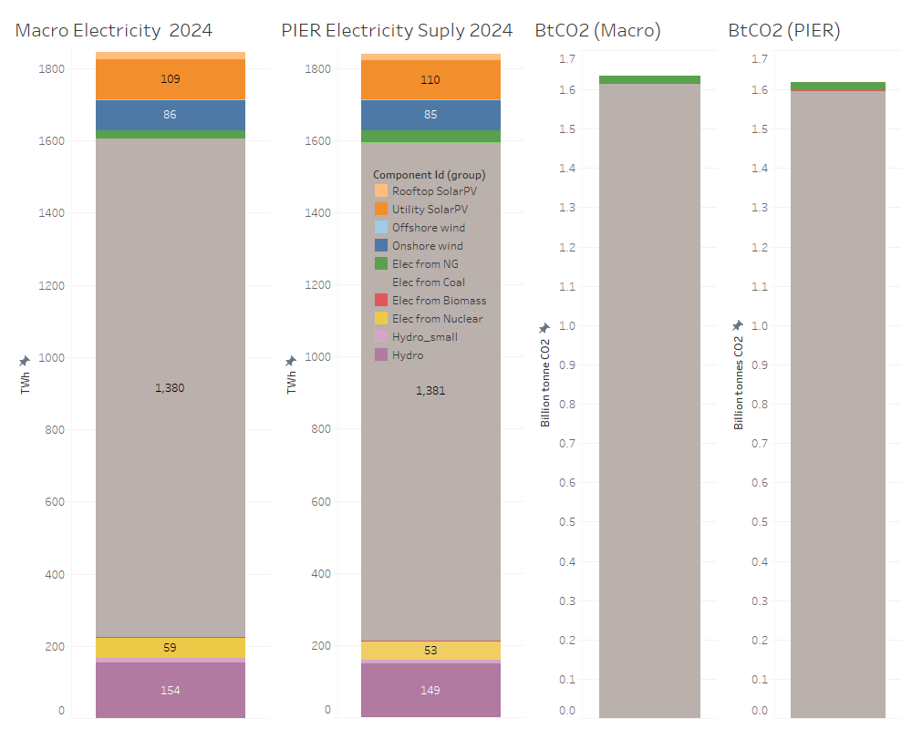
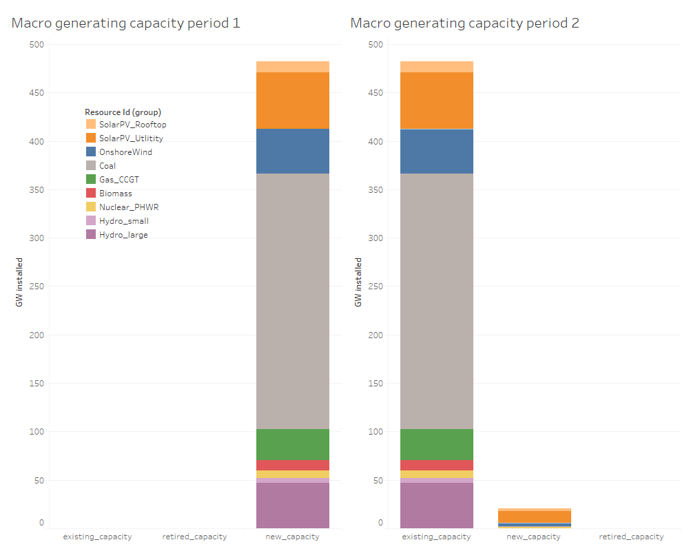

# (case) electricity_fiveZ_8736_2p_nziShadow_stable (Unofficial)

Works with the Github version of Macro, but will fail in the Official Macro version availablevia the Julia repository.

When this version reaches stable operation and represents a useful update to the *stable* version, it will be merged into *_stable. If it is time period or regional expansion of a prior model, it will be become a new *stable* version.

1 May 2026
Updated costs to use annualized investements for all legacy assets (to match PIER in 2024), and to move to CAPEX accounting for all future builds. All costs need scruitiny against PIER input/output costs to arrive at final values. Model costs are still 1e3 larger than PIER outputs!?
Added self-consumption from PIER into Macro assets via:
- Thermal generators, fuel input has been adjusted to address self consumption
- VRE, availability has been adjusted to subtract self-consumption in each hour
- Hydro, Discharge_efficiency has been updated for self-consumption

Addition of self-consumption to thermal assets now make coal emissions work as expected from Macro TEA.
Storage and TX files need to be adjusted for updated split consting approach.

 "Macro vs PIER2.0 Generation and CO2 emissions"

 "Macro Period Capacities 2023 (left), 2024 (right)"

 "Macro Period Costs 2023 (left, shows investment annuities for legacy capacity), 2024 (right shows new CAPEX investments in capacity added in 2024). All costs need confirming in PIER2.0, even 2023 annuities which have the right relative spread, but vary in magnitude by 1000x in Macro"